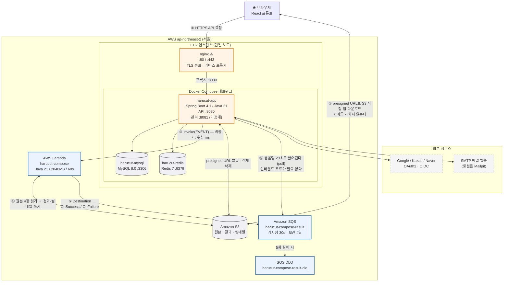
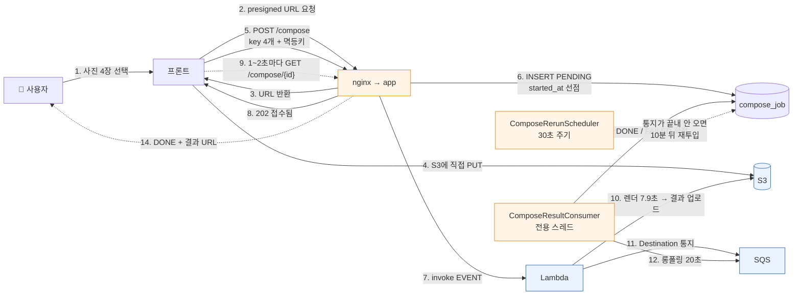
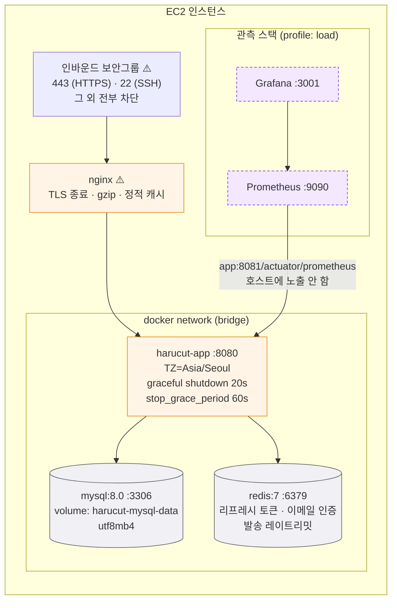

# 하루컷 아키텍처 구성도 (인프라 포함)

> draw.io에서 다시 그리기 위한 밑그림이다.
> **①·②·③** 세 장 + **draw.io 배치 가이드**로 구성했다.
> ⚠️ 표시는 이 저장소에 설정 파일이 없어서 **일반 구성으로 가정한 부분**이다 (nginx, 도메인, TLS).
> 나머지는 전부 `docker-compose.yml` · `application.yaml` · 실제 AWS 설정에서 뽑았다.

---

## ① 전체 구성도 — 한 장으로 보는 그림



### 이 그림에서 꼭 살릴 3가지

| # | 포인트 | 왜 중요한가 |
|---|---|---|
| **②** | 이미지가 **EC2를 통과하지 않는다** | presigned URL로 브라우저가 S3에 직접 올린다. 사진 4장(수 MB)이 서버 대역폭·힙을 전혀 쓰지 않는다 |
| **③** | Lambda 호출 화살표가 **단방향** | 비동기(`InvocationType.EVENT`)라 응답을 기다리지 않는다. 요청 스레드가 7.9초 잡히지 않는다 |
| **⑥** | SQS 화살표가 **EC2에서 나간다** | 서버가 끌어가는 pull이다. 인바운드 포트가 필요 없고, 서버가 죽어 있어도 통지는 큐에 쌓인다 |

> ⑥ 화살표를 반대로(SQS → EC2) 그리면 안 된다. 그러면 "SQS가 서버를 호출한다"는 뜻이 되어
> 이 설계의 핵심(배압·무노출)이 그림에서 사라진다.

---

## ② 합성 요청 한 건이 지나가는 길 (번호 흐름도)



---

## ③ EC2 내부 확대도 — 컨테이너와 포트



**밖으로 나가는 연결 (아웃바운드만 있으면 된다)**

| 대상 | 용도 | 방향 |
|---|---|---|
| S3 | presigned URL 발급, 객체 삭제 | EC2 → AWS |
| Lambda | `invoke(EVENT)` | EC2 → AWS |
| SQS | 롱폴링 수신 · 메시지 삭제 | **EC2 → AWS** |
| OAuth (Google/Kakao/Naver) | 토큰 교환, 사용자 정보, 연결 끊기 | EC2 → 외부 |
| SMTP | 인증 메일 발송 | EC2 → 외부 |

> 표에 **인바운드가 한 줄도 없다**는 게 이 구조의 특징이다.
> HTTP 콜백 방식을 골랐다면 여기에 "Lambda → EC2 :443"이 추가되고,
> 공인 엔드포인트 · 인증 · 재시도 정책이 전부 딸려 왔을 것이다.

---

## draw.io 배치 가이드

### 캔버스 레이아웃 (①번 그림 기준)

```
┌──────────────────────────────────────────────────────────────┐
│  [1행]              🌐 브라우저 (가운데 위)                    │
│                        │              ╲                       │
│                        │ ①HTTPS        ╲ ② presigned 직접     │
│  ┌─────────────────────┼────────────────╲──────────────────┐ │
│  │ AWS ap-northeast-2  ▼                 ╲                 │ │
│  │  ┌───────────────────────────┐         ╲                │ │
│  │  │ EC2                       │          ╲               │ │
│  │  │  [nginx]                  │           ╲              │ │
│  │  │     ▼                     │            ▼             │ │
│  │  │  ┌──────────────────────┐ │      ┌──────────┐        │ │
│  │  │  │ app  mysql  redis    │ │      │    S3    │        │ │
│  │  │  └──────────────────────┘ │      └──────────┘        │ │
│  │  └────┬───────────────▲──────┘            ▲             │ │
│  │       │ ③ invoke      │ ⑥ 롱폴링(pull)    │ ④           │ │
│  │       ▼               │                   │             │ │
│  │  ┌──────────┐   ┌──────────┐──────────────┘             │ │
│  │  │  Lambda  │──▶│   SQS    │                            │ │
│  │  └──────────┘ ⑤ └────┬─────┘                            │ │
│  │                      ┆ 5회 실패                          │ │
│  │                 ┌────▼─────┐                            │ │
│  │                 │   DLQ    │                            │ │
│  │                 └──────────┘                            │ │
│  └──────────────────────────────────────────────────────────┘ │
│  [최하단]   외부: Google / Kakao / Naver · SMTP  (점선 연결)   │
└──────────────────────────────────────────────────────────────┘
```

### 도형·색

draw.io 좌측 **Shapes → 더 보기 → Networking > AWS 2021**을 켜고 쓰면 된다.

| 요소 | 도형 | 채움 / 테두리 |
|---|---|---|
| AWS 리전 | 점선 사각 컨테이너 | 없음 / `#2B6CB0` 점선 |
| EC2 | AWS EC2 아이콘 + 컨테이너 | `#FFF4E5` / `#E8871E` |
| nginx | 둥근 사각 | `#FFF4E5` / `#E8871E` |
| app · 컨테이너 3개 | 사각 (EC2 안에 중첩) | `#FFFFFF` / `#E8871E` |
| MySQL · Redis · S3 | 원통(Cylinder) | `#F0F0F5` / `#666` |
| Lambda · SQS | AWS 아이콘 | `#EAF3FF` / `#2B6CB0` |
| DLQ | AWS SQS 아이콘 + **점선** 테두리 | `#FFF0F0` / `#C53030` 점선 |
| 외부 서비스 | 점선 사각 | `#F5F5F5` / `#999` 점선 |

### 화살표 규칙 (그림의 정보량은 여기서 갈린다)

| 종류 | 스타일 | 어디에 |
|---|---|---|
| **동기 요청·응답** | 실선 양방향 | 브라우저↔nginx, app↔MySQL, app↔S3 |
| **비동기 단방향(응답을 안 기다림)** | 실선 단방향 + 굵게 | app→Lambda ③, Lambda→SQS ⑤ |
| **끌어오기(pull)** | 실선 단방향, **화살표가 EC2에서 SQS 쪽으로** | app→SQS ⑥ |
| **폴백·예외 경로** | 점선 | SQS→DLQ, 재실행 스케줄러 |
| **서버를 우회하는 경로** | 실선 + 다른 색(초록) | 브라우저↔S3 ② |

②를 **초록으로 따로 칠하면** "이미지 트래픽이 서버를 안 지난다"가 설명 없이 보인다.

### 라벨에 넣으면 좋은 수치

- Lambda 박스: `2048MB · 60s · 렌더 7.9초`
- SQS 박스: `롱폴링 20s · 가시성 30s · 보관 4일`
- app→Lambda 화살표: `invoke 수십 ms (비동기)`
- app 박스: `graceful shutdown 20s`
- DLQ 화살표: `maxReceiveCount 5`

### 안 그려도 되는 것

- IAM 역할·정책 — 선만 늘고 이야기가 없다
- VPC 서브넷·라우팅 테이블 — 단일 EC2라 나눌 게 없다
- Prometheus / Grafana — 부하 테스트 전용 프로파일이라 ③번 확대도에만 남긴다

---

## ⚠️ 확인이 필요한 가정

이 저장소에는 `deploy/`와 nginx 설정이 없다(다른 데스크탑에 있음).
아래는 일반 구성으로 가정한 것이라, 실제와 다르면 그림에서 고쳐야 한다.

| 항목 | 가정한 값 | 실제와 다를 수 있는 부분 |
|---|---|---|
| nginx | EC2 호스트에 설치, 443 TLS 종료 후 `app:8080`로 프록시 | 컨테이너로 띄웠거나, ALB를 쓰거나, Caddy일 수 있다 |
| 인증서 | Let's Encrypt (certbot) | ACM + ALB면 nginx 자리가 ALB로 바뀐다 |
| 도메인 | Route 53 → Elastic IP | 다른 DNS를 쓸 수 있다 |
| MySQL | **EC2 안 도커 컨테이너** (`docker-compose.yml` 기준) | RDS로 옮겼다면 EC2 밖으로 빼야 한다 |
| 프론트 | 별도 호스팅 (Vercel / S3+CloudFront) | nginx가 정적 파일까지 서빙한다면 nginx 박스에 적어야 한다 |
