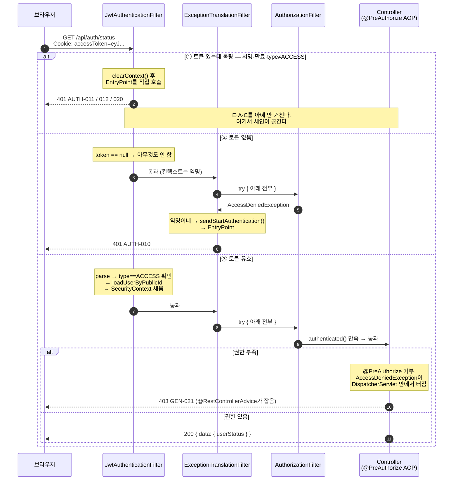
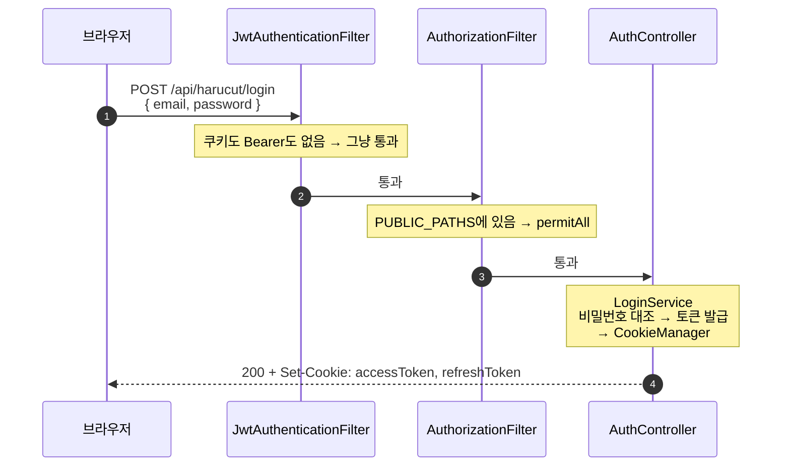

# 인증 플로우 (Java 재구현 기준)

> 이 문서는 **우리가 만든 것**을 기록한다. `docs/` 의 다른 문서(00~12)가 기존 Kotlin 구현의 역추출 명세인 것과 성격이 다르다.
> 필터 순번은 Spring Security 7.1.0 `FilterOrderRegistration` 바이트코드에서 확인한 값이다.

관련 코드

| 파일 | 역할 |
|------|------|
| [`SecurityConfig`](../src/main/java/com/harucut/config/SecurityConfig.java) | 체인 구성, PUBLIC_PATHS, CORS, EntryPoint 등록 |
| [`JwtAuthenticationFilter`](../src/main/java/com/harucut/auth/security/JwtAuthenticationFilter.java) | 토큰 추출 → 검증 → SecurityContext 채움 |
| [`CustomAuthenticationEntryPoint`](../src/main/java/com/harucut/auth/security/CustomAuthenticationEntryPoint.java) | 401을 공통 JSON 봉투로 |
| [`CustomUserPrincipal`](../src/main/java/com/harucut/auth/security/CustomUserPrincipal.java) | `UserStatus` → authority 매핑 |
| [`GlobalExceptionHandler`](../src/main/java/com/harucut/common/exception/GlobalExceptionHandler.java) | `@PreAuthorize` 거부를 403 `GEN-021`로 |

---

## 1. 시퀀스

실제 필터는 열 개가 넘지만, **결과를 가르는 건 다섯 줄뿐이다.** 나머지(`Cors`, `SecurityContextHolder`, `HeaderWriter`, `Logout`, `Anonymous`…)는 조건에 따라 행동이 갈리지 않으므로 뺐다.

| 세로줄 | 왜 남겼나 |
|--------|-----------|
| `JwtAuthenticationFilter` | 우리가 만든 것. **탈출구 1**이 여기서 난다 |
| `ExceptionTranslationFilter` | 401이냐 403이냐를 **여기서 가른다** |
| `AuthorizationFilter` | `authorizeHttpRequests` 평가. **탈출구 2**의 발원지 |
| `Controller (@PreAuthorize)` | **탈출구 3**. 필터가 아니라 서블릿 안쪽 |



**그림에서 읽어야 할 것 셋**

1. **①의 응답 화살표가 `E`·`A`·`C`를 가로질러 되돌아간다.** 우리 필터가 `E`보다 **왼쪽(=앞)**이라 예외를 던져봐야 `E`가 못 잡는다. 그래서 EntryPoint를 직접 부르고 체인을 끊는다.
2. **②는 `A`가 던지고 `E`가 받는다.** 화살표가 오른쪽에서 왼쪽으로 되돌아온다 — `E`가 `A`보다 앞에 있으니 가능한 일이다. `E`는 이미 콜스택 아래에 `try/catch`로 앉아 있다.
3. **③의 403은 `E`까지 올라가지도 않는다.** `@PreAuthorize`는 필터가 아니라 AOP라서 `@RestControllerAdvice`가 먼저 낚아챈다. **그래서 `AccessDeniedHandler`를 등록하지 않았다.**

### 로그인은 이 중 어디에도 안 걸린다



`formLogin`·`httpBasic`을 껐고 `UsernamePasswordAuthenticationFilter`는 `/login` POST만 보므로 우리 경로와 무관하다.
**로그인은 Security가 손대지 않는 평범한 컨트롤러다.** Security는 "통과시켜라"만 하고 빠진다.

### 참고 — 전체 필터 순서

요청은 왼쪽 기둥을 타고 내려가고 응답은 되돌아 올라온다. 한 번 호출되고 끝나는 게 아니라,
`chain.doFilter()` 안쪽에 다음 필터가 통째로 들어있는 **재귀 구조**다.

| 순번 | 필터 | 하는 일 |
|------|------|---------|
| 2 | `DisableEncodeUrlFilter` | URL에 세션ID 안 붙임 |
| – | `CorsFilter` | Origin 검사. 허용 목록 밖이면 여기서 끝 |
| 6 | `SecurityContextHolderFilter` | 빈 컨텍스트 준비 (STATELESS라 세션 조회 안 함) |
| 8 | `HeaderWriterFilter` | 보안 헤더 부착 |
| 10 | `LogoutFilter` | |
| **14 앞** | **`JwtAuthenticationFilter`** | **우리가 만든 것.** 토큰 추출 → 검증 → 컨텍스트 채움 |
| 28 | `AnonymousAuthenticationFilter` | 컨텍스트가 비었으면 익명으로 채움 |
| 30 | `ExceptionTranslationFilter` | 아래 전부를 `try/catch`로 감쌈. 401/403을 가름 |
| 31 | `AuthorizationFilter` | `authorizeHttpRequests` 평가 |
| — | `DispatcherServlet` → `@PreAuthorize`(AOP) → Controller | 여기부터는 필터 바깥 |

순번은 Spring Security 7.1.0 `FilterOrderRegistration` 바이트코드에서 읽은 값이다.
우리 필터는 `addFilterBefore(..., UsernamePasswordAuthenticationFilter.class)`로 붙였으니 **14번 바로 앞**이다.

`csrf`·`formLogin`·`httpBasic`을 껐기 때문에 `CsrfFilter`·`UsernamePasswordAuthenticationFilter`·`BasicAuthenticationFilter`는 체인에 없다.

---

## 2. 시나리오 — 보호 API (`GET /api/auth/status`)

```
브라우저
   │  GET /api/auth/status
   │  Cookie: accessToken=eyJ...
   ▼
JwtAuthenticationFilter
   │  ① resolveToken: 쿠키 우선 → 없으면 Bearer 폴백
   │  ② JwtTokenService.parse(token)
   │       서명 불일치·형식 오류 → BusinessException(AUTH-011)
   │       만료               → BusinessException(AUTH-012)
   │  ③ claims.type() != ACCESS → CustomAuthenticationException(AUTH-011)
   │  ④ loadUserByPublicId(publicId)
   │       없으면 → CustomAuthenticationException(AUTH-020)
   │  ⑤ UsernamePasswordAuthenticationToken.authenticated(
   │         principal, null, principal.getAuthorities())
   │     → SecurityContextHolder에 저장
   ▼
AuthorizationFilter        anyRequest().authenticated() → 익명 아님 → 통과
   ▼
AuthStatusController       @AuthenticationPrincipal CustomUserPrincipal
   ▼
200  { "code": "GEN-000", "status": 200, "data": { "userStatus": "ACTIVE" } }
```

---

## 3. 빠져나가는 지점 세 곳

같은 401이라도 **누가 만들었느냐가 다르다.** 이걸 구분 못 하면 에러 코드가 왜 다른지 설명이 안 된다.

| # | 상황 | 만드는 주체 | 결과 |
|---|------|-------------|------|
| 1 | 토큰이 **있는데** 불량 | `JwtAuthenticationFilter`가 EntryPoint를 **직접 호출** | 401 `AUTH-011` / `AUTH-012` / `AUTH-020` |
| 2 | 토큰이 **없음** | `AuthorizationFilter` 거부 → `ExceptionTranslationFilter`가 EntryPoint 호출 | 401 `AUTH-010` |
| 3 | 인증은 됐는데 권한 부족 | `@PreAuthorize` → `@RestControllerAdvice` | 403 `GEN-021` |

### 왜 1번은 예외를 안 던지고 직접 호출하나

`JwtAuthenticationFilter`는 순번 14 앞, `ExceptionTranslationFilter`는 30이다.
**우리가 더 앞이라 여기서 던진 예외는 아무도 안 잡는다.** 서블릿 컨테이너까지 올라가 500이 된다.
그래서 `reject()`에서 `SecurityContextHolder.clearContext()` 후 `entryPoint.commence()`를 직접 부르고 `return`으로 체인을 끊는다.
덕분에 `AUTH-011` / `AUTH-012` 코드가 보존된다.

### 왜 3번은 필터를 안 거치나

`@PreAuthorize`는 **필터가 아니라 AOP 인터셉터**(`AuthorizationManagerBeforeMethodInterceptor`)다.
`@EnableMethodSecurity`가 등록하고, 컨트롤러 빈을 프록시로 감싼다.
따라서 거부는 **DispatcherServlet 안쪽**에서 터지고, `@RestControllerAdvice`가 먼저 잡는다.
`ExceptionTranslationFilter`까지 올라가지 않으므로 **`AccessDeniedHandler`가 필요 없다.**

> 만약 role 검사를 `authorizeHttpRequests(...).hasRole("ADMIN")`으로 했다면
> `AuthorizationFilter`가 **서블릿 밖에서** 던지고, `@RestControllerAdvice`는 못 잡고,
> `ExceptionTranslationFilter`가 `AccessDeniedHandler`를 찾다가 없어서 Spring 기본 HTML 403이 나간다.
> **그래서 role 검사를 전부 `@PreAuthorize`로 몰았다.**

---

## 4. authority 매핑

`CustomUserPrincipal.getAuthorities()`

| `UserStatus` | authority |
|--------------|-----------|
| `ACTIVE` | `user.userRole` (`ROLE_USER` 또는 `ROLE_ADMIN`) |
| `DELETED_REQUESTED` | `ROLE_DELETED_REQUESTED` **하나만** |
| `BLOCKED`, `DELETED` | 빈 목록 |

`DELETED_REQUESTED`가 `ROLE_USER`를 잃는 이유는 **fail-closed**다.
새 API를 만들 때마다 "탈퇴 요청한 사람 막아야지"를 기억할 필요 없이, 기본이 차단이고 허용할 것만 명시한다.
`ROLE_USER`를 유지한 채 `ROLE_DELETED_REQUESTED`만 추가했다면 반대가 된다 — 기본이 허용이고, 막을 곳을 하나하나 기억해야 한다.

빈 목록이 아닌 이유는 `POST /api/harucut/reactivate`(`@PreAuthorize("hasRole('DELETED_REQUESTED')")`) 때문이다.
authority가 아예 없으면 탈퇴 취소조차 못 한다.

**단, 이 설계는 일반 API에 `hasRole('USER')`가 실제로 붙어 있어야만 성립한다.**
`anyRequest().authenticated()`만으로는 `DELETED_REQUESTED`도 익명이 아니므로 전부 통과한다.
기존 Kotlin 구현이 바로 그 상태다 — 자세한 건 [`frontend-changes.md`](frontend-changes.md).

---

## 5. 확인 방법

실제 체인을 눈으로 보려면 로그 레벨을 올린다.

```yaml
logging:
  level:
    org.springframework.security.web.DefaultSecurityFilterChain: INFO
```

기동 시 `Will secure any request with filters: ...` 한 줄에 순서대로 찍힌다.
