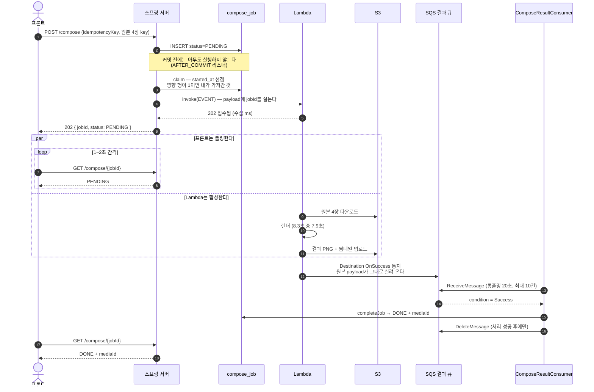
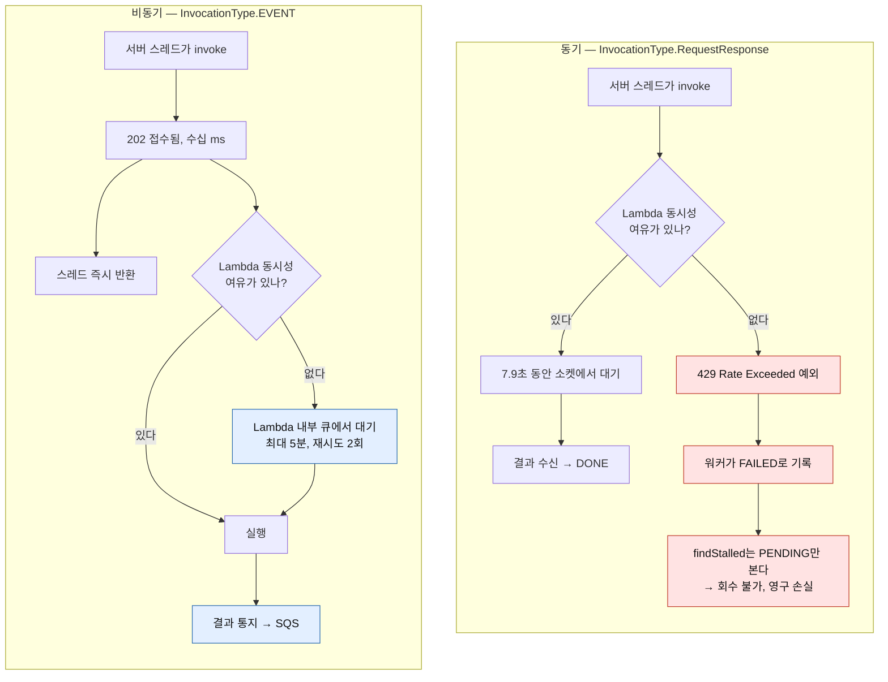
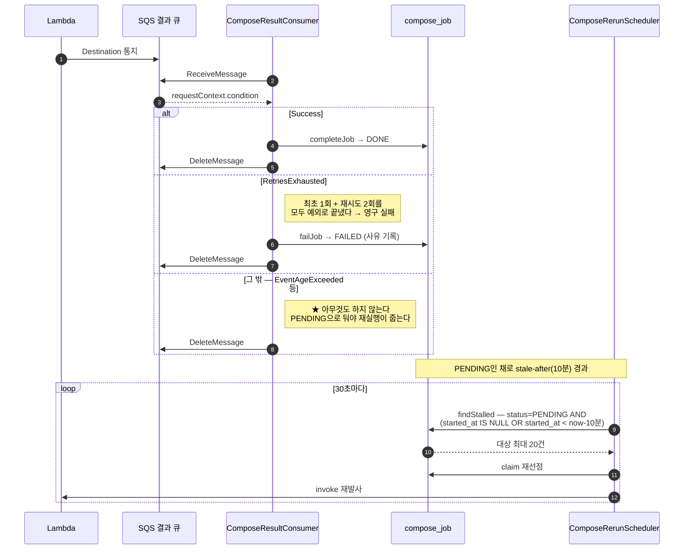

# 블로그용 다이어그램 (Mermaid)

그대로 복사해서 붙이면 된다. GitHub·Notion·Velog·대부분의 정적 블로그가 렌더링한다.
각 다이어그램 아래에 **어디에 넣을지**와 **어떤 수치를 곁들일지**를 적어뒀다.

---

## ① 정상 흐름 — 요청 하나가 끝까지 가는 길

**어디에**: 글 앞부분, "지금 구조는 이렇다"를 한 장으로 보여줄 때.

**곁들일 수치**
- 합성 1건 **8.3초**, 그중 Lambda 안이 **7.9초(95%)**
- invoke는 **수십 ms** — 그래서 요청 스레드에서 바로 불러도 된다
- 폴링 간격 1~2초 → 작업 하나에 평균 **약 6번**

**짚을 포인트 세 개**
1. `claim`이 invoke보다 **먼저**다. 선점에 실패하면 아예 안 던진다 — 재실행과 이벤트가 같은 Job을 밀어 넣어도 한 번만 돈다.
2. payload에 `jobId`를 싣는 이유는 **Lambda가 읽으려는 게 아니라** Destination 통지에 원본 payload가 그대로 돌아오기 때문이다. 서버가 그걸로 Job을 찾는다.
3. 메시지 삭제는 **처리 성공 후에만**. 실패하면 일부러 안 지운다 → 가시성 타임아웃 뒤 재전달 → 5회 실패하면 DLQ.

---

## ② 동기 vs 비동기 — 429가 어디로 가는가

**어디에**: 글의 **핵심 전환점**. "스레드 늘리니 선형으로 올랐다" 그래프 **바로 다음**에 놓을 것.

**곁들일 수치** (2026-08-21, reserved concurrency 30 / 동시 18건)
| | 값 |
|---|---|
| 성공 | 10건 |
| `429 Rate Exceeded`로 FAILED | **8건 (44%)** |
| 70초 기다린 뒤 회수된 건수 | **0건** |

**⚠️ 이 다이어그램이 막아야 하는 오해**

"스레드를 늘리니 처리량이 선형으로 올랐다"만 실으면 독자가 이렇게 묻는다 —
**"선형으로 오르는데 왜 비동기로 바꿨지? 스레드만 더 늘리면 되잖아."**

그래서 이 문장이 반드시 따라야 한다:

> 스레드를 늘리면 **우리 쪽** 처리량은 오르지만, 그 요청이 향하는 **Lambda의 동시성 한도는 그대로다.**
> 그래서 스레드를 늘릴수록 429를 더 자주 만나고, 동기 호출에서 429는
> 예외 → FAILED → `findStalled`가 PENDING만 보므로 **영구 손실**이 된다.
> 즉 스레드를 늘리는 것은 **처리량과 손실률을 동시에 올린다.**

쐐기 한 줄:
> 가상 스레드로 바꿔도 똑같다. 스레드 비용은 사라지지만 **429는 그대로다.**

그리고 비동기가 실제로 한 일을 정확히 쓸 것:
> 처리량을 늘린 게 아니라 **초과분을 버리지 않고 줄 세웠다.**
> 병목이 우리 스레드가 아니라 Lambda 동시성이라, 비동기로 바꿔도 처리량 자체는 안 늘어난다.
> 동기는 한도 초과분이 **깨지고**, 비동기는 **대기한다.** 그 차이가 전부다.

**그래프 팁**: x축에 스레드 수를 놓고 **처리량과 실패율을 같이** 그릴 것.
처리량만 그리면 성공처럼 보이지만, 실패율을 겹치면 같은 지점에서 급등하는 게 보인다.
그 무릎(knee)이 글의 하이라이트다.

---

## ③ 실패 경로 — 세 갈래로 갈리고, 한 갈래는 일부러 아무것도 안 한다

**어디에**: "그래서 지금은 안 깨지나?"에 답하는 절.

**★ 이 갈래가 이 설계의 요지다.** `EventAgeExceeded`를 FAILED로 적으면
**재시도 가능한 실패가 영구 손실**이 된다 — 2026-08-21에 429가 정확히 그렇게 죽었다.
"모르는 condition은 건드리지 않는다"가 기본값이어야 한다. (그래서 `condition`을 enum이 아니라
String으로 받는다. AWS가 새 값을 추가해도 역직렬화가 깨지면 안 되고, 모르는 값은
"아무것도 안 한다"로 떨어져야 하니까.)

### ③-B 곁들일 타임라인 — `stale-after`가 왜 10분인가

**핵심 문장**:
> 재시도 계층이 **두 개**다 — Lambda 내부 큐(이벤트 수명)와 우리 재실행 배치(`stale-after`).
> 둘이 겹치면 같은 합성이 두 번 돈다. 그래서 **Lambda가 포기하는 시점이 우리가 다시 던지는 시점보다 먼저**여야 한다.
> `stale-after: 10분`은 임의의 값이 아니라 **이벤트 수명 5분 + 함수 타임아웃 60초 + 여유**에서 거꾸로 유도한 값이다.

**실화 하나 넣을 거리**: `MaximumEventAgeInSeconds`의 기본값은 **21600초(6시간)**다.
설정을 빠뜨리면 이 그림이 깨진다 — Lambda가 아직 붙잡고 있는데 10분에 또 던지게 된다.
데이터는 안전하지만(결정적 S3 key + `status != PENDING` 가드) **컴퓨트 비용과 S3 쓰기가 배수로** 늘어난다.
실제로 이 프로젝트도 한동안 기본값이었고, 나중에 설정을 조회해보고 나서야 발견했다.

> 300으로 두면 **"Lambda가 포기했다"는 신호를 받고** 다시 던진다.
> 21600이면 **신호 없이 추측으로** 다시 던진다.

---

## 글에 넣으면 좋을 숫자 모음

| 항목 | 값 | 출처 |
|---|---|---|
| 합성 1건 | 8.3초 (Lambda 안 7.9초) | 실측 |
| 동기 + 동시 18건 | 성공 10 / **429 실패 8** | 실측 2026-08-21 |
| 그 8건의 회수 | **0건** (findStalled가 PENDING만 봄) | 실측 |
| 큐 상한 초과 시 (동시 30건) | 이전 26건 영구 PENDING → 이후 **0건** | 실측 |
| 폴링 횟수 | 작업당 약 6번 (8.3초 ÷ 1.5초) | 계산 |
| 롱폴링 유휴 호출 | 20초 기준 인스턴스당 월 13만 (10초면 26만) | 계산 |
| SQS 추가 비용 | 월 **$0.65** (100만 건 기준) | 계산 |
| 같은 규모 Lambda 컴퓨트 | 월 **$257** | 계산 |

**마지막 문단 후보**:
> 통지 채널을 고르는 데 지연도 요금도 결정 축이 아니었다.
> 채널 간 요금 차이는 100만 건에 월 $1.20이고, 지연 차이는 폴링 주기 1~2초 뒤에 가려진다.
> 실제로 갈린 축은 하나였다 — **함수가 죽었을 때, 아니 실행조차 되지 않았을 때도 알 수 있는가.**
