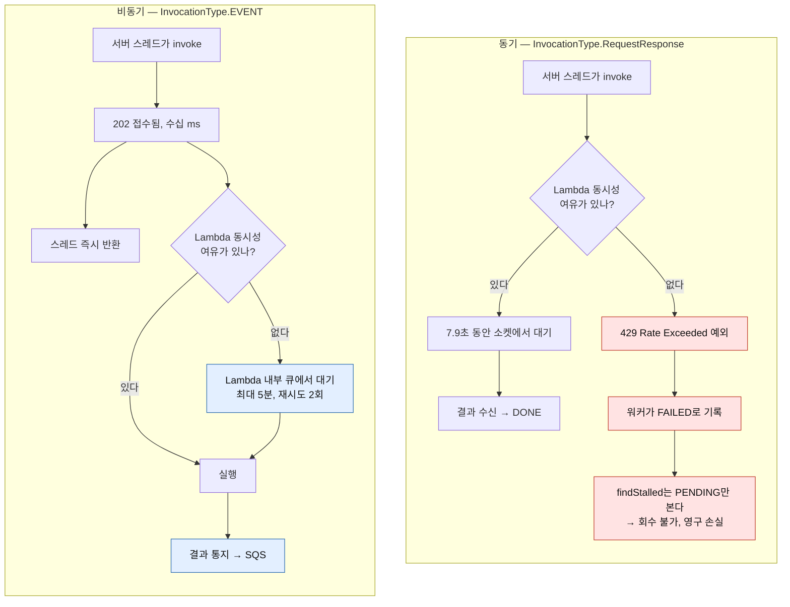
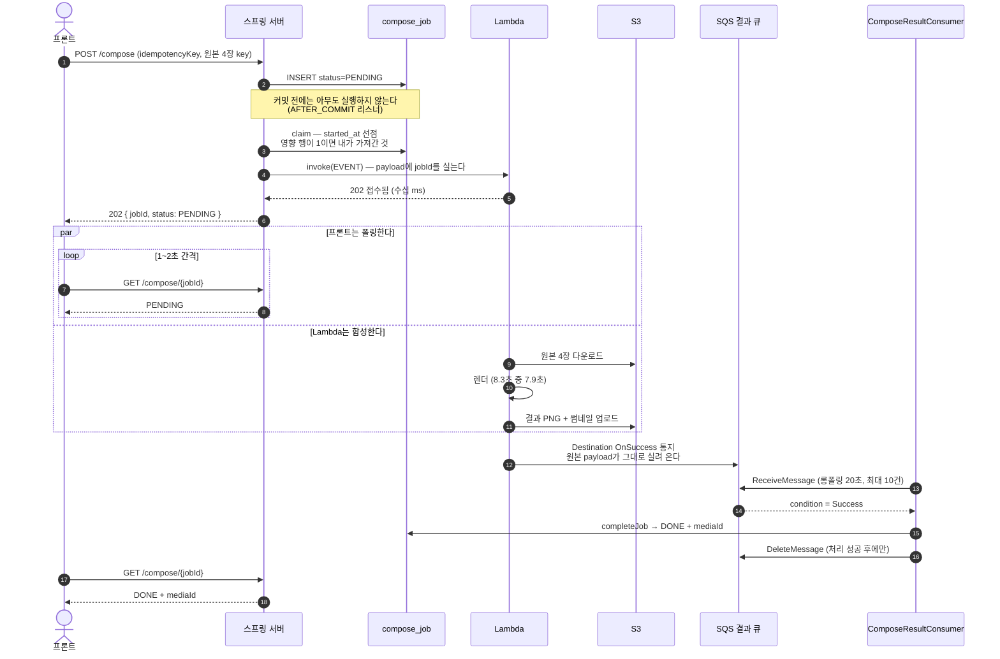
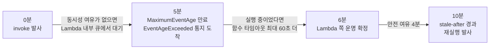
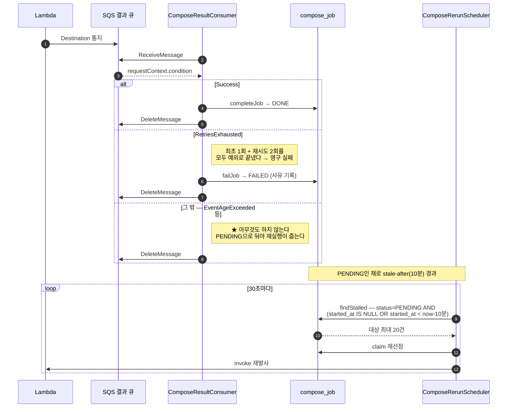

# 8초짜리 작업 하나를 되받는 데 큐를 세 번 갈아탔다

> 네컷 사진 합성 파이프라인을 만들면서, 스레드풀 큐 → DB 테이블 → SQS로 옮겨간 기록.
> 결론부터 말하면 **성능 때문이 아니라 실패를 관측하기 위해서**였다.

---

## 만든 것

원본 사진 4장 + 프레임을 받아 한 장으로 합성해 주는 API다. 프론트의 canvas가 아니라
**서버가 그린다** — 로컬 폰트·색 프로파일 차이 없이 항상 같은 픽셀이 나와야 했고,
결과를 보관함에 남겨야 했기 때문이다.

문제는 이게 **8.3초** 걸린다는 것이다. 그중 렌더링이 **7.9초(95%)**다.

HTTP 요청 하나로 8.3초를 붙잡을 수는 없었다. 그래서 처음부터 접수와 실행을 나눴다.

```
POST /compose  →  202 { jobId, PENDING }
GET  /compose/{jobId}  →  폴링
```

여기까지는 흔한 설계다. 문제는 그 다음이었다.

---

## 1막. 스레드풀 큐를 믿었다가 작업을 잃었다

### 할 일 목록이 두 군데 있었다

처음 구조는 이랬다. 요청이 오면 `compose_job` 테이블에 행을 넣고, 커밋 후
스프링 이벤트를 쏘면 `@Async` 워커가 스레드풀에서 집어간다.

`compose_job` 테이블은 **내구성 있는 큐로 설계했다.** 서버가 죽어도 PENDING 행은
남으니까. 그런데 **실행 트리거가 커밋 후 인메모리 이벤트 하나뿐이었다.**
그것을 놓치면 PENDING 행을 다시 집어갈 소비자가 없었다.

할 일 목록이 DB와 스레드풀 큐 두 군데에 있고, **후자가 휘발성**이라 생기는 문제였다.

### 유실 경로가 셋이었다

1. **큐 상한 초과** → `RejectedExecutionException`.
   그런데 이게 `AFTER_COMMIT` 리스너 안에서 터진다. 요청은 이미 202를 받고 나간 뒤라
   **클라이언트는 거부당한 걸 모른다.**
2. **서버 종료** → `ExecutorConfigurationSupport`가 기본값에서 `shutdownNow()` 후
   남은 작업을 전부 취소한다. 즉 **배포할 때마다 재현된다.**
3. **실행 중 프로세스 사망** → 결과를 기록할 주체가 사라진다.

셋 다 결과가 같다. Job은 PENDING으로 남고, 프론트 폴링이 끝나지 않고,
같은 멱등키로 재시도해도 기존 Job을 그대로 돌려받아 **새 실행이 일어나지 않는다.**

### DB가 이미 큐였다

해결은 "큐를 하나 더 넣자"가 아니라 **"이미 큐인 DB를 실제로 큐처럼 쓰자"**였다.

**`started_at` 컬럼을 추가하고 조건부 UPDATE로 실행을 선점했다.**

```sql
UPDATE compose_job
   SET started_at = :now
 WHERE id = :jobId
   AND status = 'PENDING'
   AND (started_at IS NULL OR started_at < :staleBefore)
```

영향 행이 1이면 내가 가져간 것이다. **서버가 몇 대든 안전하다.**
상태 enum과 API 응답 계약은 그대로 뒀다 — 이건 컬럼이지 상태가 아니다.

그리고 **버려진 PENDING을 다시 던지는 배치**를 30초마다 돌렸다.
- `started_at`이 비어 있으면 아무도 안 집어간 것이라 **즉시**
- 오래됐으면 실행자가 죽은 것이라 **`stale-after` 경과 후**

전자는 임의의 시간 기준이 필요 없고, 후자의 기준은 나중에 Lambda 이벤트 수명에서
유도했다(6막에서 다시 나온다).

### 측정

큐 상한을 2로 낮춘 환경에서 동시 30건:

| | 202 응답 | 실제 실행 | 영구 PENDING |
|---|---|---|---|
| 이전 | 30건 | **4건** | **26건** |
| 이후 | 30건 | 30건 | **0건** |

여기에 graceful shutdown(`waitForTasksToCompleteOnShutdown`)을 붙여
**정상 배포에서는 큐를 비우고 내려가게** 했다. 못 비운 꼬리는 재실행이 줍는다.
예방과 복구를 나눠 맡긴 것이다.

---

## 2막. 스레드를 늘렸더니 더 많이 잃었다

여기서 렌더링을 Lambda로 옮겼다. CPU 바운드 작업이 API 서버 코어를 먹는 게 싫었고,
피크와 평균의 차이가 컸기 때문이다.

그리고 부하 테스트를 하면서 **스레드 수를 늘리면 처리량이 선형으로 오르는 걸** 봤다.
당연해 보였다. 8.3초 중 7.9초를 소켓에서 기다리기만 하니까, 스레드를 늘리면
동시에 더 많이 기다릴 수 있다.

**그런데 어느 지점부터 실패율이 튀었다.**

### 429는 밀리는 게 아니라 깨진다

동기 호출(`InvocationType.RequestResponse`)은 Lambda 동시성 한도를 만나면
**대기하지 않는다. 예외를 던진다.**

**같은 코드를 그대로 다시 재봤다.** 개선 전 커밋(`e32247a`)으로 이미지를 만들어
스레드 수만 바꿔 가며 동시 30건을 던졌다. Lambda 동시 실행 한도는 10이다.

| 스레드 풀 | 성공 | `429`로 FAILED | 전부 끝나기까지 |
|---|---|---|---|
| **2개** | 30건 | **0건** | 30초 |
| **20개** | 21건 | **9건 (30%)** | **10초** |

**스레드를 10배로 늘리자 3배 빨라졌고, 동시에 30%를 잃었다.**
실패 사유는 9건 전부 같았다.

```
Rate Exceeded. (Service: Lambda, Status Code: 429)
```

그리고 그 9건은 끝까지 돌아오지 않았다. 워커가 예외를 잡아 Job을 FAILED로 기록했는데,
**재실행 배치의 `findStalled`는 PENDING만 본다.** FAILED가 된 건 영영 회수되지 않는다.
1막에서 만든 안전망이 여기서는 작동하지 않았다.

### 그래서 이 문장이 중요하다

> **스레드를 늘리면 우리 쪽 처리량은 오르지만, 그 요청이 향하는
> Lambda의 동시성 한도는 그대로다.
> 스레드를 늘릴수록 429를 더 자주 만나고, 동기 호출에서 429는 영구 손실이 된다.
> 즉 스레드를 늘리는 것은 처리량과 손실률을 동시에 올린다.**

처리량 그래프만 보면 성공처럼 보인다. 실패율을 겹쳐 그려야 무릎(knee)이 보인다.

가상 스레드로 바꿔도 똑같다. 스레드 비용은 사라지지만 **429는 그대로다.**
병목이 우리 스레드가 아니기 때문이다.

### 비동기 전환은 처리량 개선이 아니다

`InvocationType.EVENT`로 바꿨다. Lambda가 요청을 자기 내부 큐에 넣고 202만 돌려준다.
동시성이 없으면 큐에서 대기하고, 실패하면 재시도한다.



**정확히 말하면 처리량은 늘지 않았다.** 병목이 Lambda 동시성이니까 그대로다.
비동기가 한 일은 **초과분을 버리지 않고 줄 세운 것**이다.
동기는 한도 초과분이 *깨지고*, 비동기는 *대기한다.* 그 차이가 전부다.

부수 효과로 `invoke`가 수십 ms에 끝나게 되면서 **스레드풀과 `@Async`를 통째로 지웠다.**
요청 스레드에서 바로 불러도 되기 때문이다. 코드가 줄어든 건 이득이지만,
그게 비동기로 바꾼 이유는 아니다.

---

## 3막. 그런데 결과는 어떻게 되받나

비동기의 대가가 여기서 나온다. **호출의 응답이 더는 결과가 아니다.**
202(접수됨)만 돌아온다. 결과를 되받을 길을 새로 만들어야 했다.

### 후보를 다 세워봤다

| | 방식 |
|---|---|
| C1 | Lambda 함수 코드가 우리 서버로 **HTTP 콜백** |
| C2 | Lambda 함수 코드가 **Redis Stream**에 XADD |
| C3 | **Lambda Destinations → SQS**, 서버가 폴링 |
| C4 | 통지를 안 받고 서버가 **S3 결과 객체를 폴링** |
| C5 | Destinations → **SNS → HTTPS 구독** → 우리 서버 |
| C6 | Destinations → **EventBridge → API destination** → 우리 서버 |

처음엔 "Redis가 이미 스택에 있으니 그게 제일 빠르고 싸겠다"고 생각했다.
**틀렸다.** 이 구간의 **생산자가 Lambda, 즉 우리 네트워크 밖**이기 때문이다.
"같은 네트워크라 빠르다"는 전제가 여기서는 성립하지 않는다.

### 실패를 분류하니 답이 나왔다

"함수가 죽으면 코드가 보고 못 한다"는 뭉뚱그린 말이었다. 쪼개보니 이랬다.

| 실패 | 함수가 도나 | 함수 코드가 보고 가능한가 |
|---|---|---|
| **스로틀 (429)** | **아예 안 돈다** | **원천 불가** |
| **EventAgeExceeded** | **아예 안 돈다** | **원천 불가** |
| 타임아웃 (60초) | 돌다 죽는다 | 워치독으로 T-2초에 자가 보고 **가능** |
| OOM | 돌다 죽는다 | `-Xmx` 조정 시 부분적으로 가능 |
| 언핸들드 예외 | 돈다 | try/catch로 가능 |

**위 두 줄이 결정적이었다.** 함수가 실행조차 되지 않는 시간대라
**어떤 코드 기법으로도 못 덮는다.** 워치독으로도 안 된다.
그리고 그게 2막에서 9건을 잃은 바로 그 실패다.

함수 밖에서 실패를 관측하려면 **Lambda Destinations**를 써야 하고,
그 타깃은 AWS가 정해놨다 — SQS / SNS / S3(실패만) / Lambda / EventBridge.
Redis Stream도 RabbitMQ도 HTTP 엔드포인트도 **직접 타깃으로는 못 넣는다.**

다만 릴레이를 한 칸 끼우면 우리 서버에 HTTP로 닿을 수는 있다(C5·C6).
그래서 진짜 축은 "AWS냐 아니냐"가 아니라 **push냐 pull이냐**였다.

### push vs pull

| | 푸시 (C1·C2·C5·C6) | 풀 (C3·C4) |
|---|---|---|
| 전제 | **서버가 지금 살아서 받을 수 있다** | 없음 |
| 전제가 깨지는 지점 | 재배포 30초 / SNS 3600초 하드 리밋 / EventBridge 응답 5초 | — |
| 과부하 시 | 서버로 밀려든다 | 서버가 자기 속도로 끌어간다 |
| 유실 방지 백스톱 | 재시도 정책 + DLQ = **결국 SQS** | 큐 자체 |

푸시 후보들의 신뢰성을 끝까지 밀면 **DLQ로 SQS를 달게 된다.**
그럴 거면 처음부터 SQS를 쓰는 게 짧았다.

### 요금은 결정 축이 아니었다

계산해보고 놀랐다. **채널 후보 사이의 요금 차이가 100만 건/월에 최대 $1.20**이다.
같은 규모에서 Lambda 컴퓨트만 **$257**이 나간다. 채널 요금은 그 **0.5% 미만**이다.

지연도 마찬가지다. 8.3초 중 7.9초가 Lambda 안이고, 그 앞에 폴링 주기 1~2초가 있다.
통지가 20ms냐 300ms냐는 **사용자에게 도달하지 못한다.**

> **지연도 요금도 축이 아니었다. 남은 축은 하나였다 —
> 함수가 죽었을 때, 아니 실행조차 되지 않았을 때도 알 수 있는가.**

그래서 **C3(Destinations → SQS)**를 택했다.

### 지금 구조



작은 트릭 하나. **payload에 `jobId`를 실었는데, Lambda는 이 값을 읽지 않는다.**
Destination 통지에 원본 payload가 그대로 실려 오기 때문에,
서버가 그걸로 "이게 어느 Job인지"를 찾는다.

---

## 4막. 큐에서는 롱폴링으로 가져온다

SQS는 밀어주지 않는다. 서버가 가져와야 한다. 방법은 둘뿐이다.

**숏폴링**은 큐가 비면 즉시 빈 응답을 준다. 그래서 `sleep`으로 주기를 만들어야 하고,
**그 주기가 곧 통지 지연이 된다.** 1초로 줄이면 유휴 호출만 월 259만 건이라
무료 티어(100만)를 넘고, 늘리면 사용자가 그만큼 더 기다린다.

게다가 숏폴링은 SQS 서버의 **부분집합만 샘플링**해서 메시지가 있는데도 빈 응답이 올 수 있다.
AWS 문서가 이렇게 쓴다 — *"메시지 수가 극히 적으면 특정 응답에서 아무 메시지도 못 받을 수 있다."*
**우리 큐가 정확히 그 모양이다.** 통지는 드문드문 1건씩 온다.

**롱폴링은 전 서버를 조회하고, 메시지가 도착하면 즉시 반환한다.**
지연과 호출 수를 동시에 개선한다 — 트레이드오프가 아니라 한쪽이 모든 축에서 이긴다.

### 값은 상한인 20초로

흔한 오해가 "길게 잡으면 통지가 늦게 온다"인데 반대다.
**대기 시간은 "메시지가 없을 때 얼마나 기다렸다 빈손으로 돌아올까"일 뿐**이라
정상 경로의 지연에는 영향이 없다. 실제로 갈리는 건 셋이다.

| | 10초 | 20초 |
|---|---|---|
| 유휴 호출/월/인스턴스 | 26만 | **13만** (무료 티어 안에서 3.8대 → 7.7대) |
| 거짓 빈 응답 확률 | 높음 | **최소** |
| 종료 대기 상한 | **10초** | 20초 |

롱폴링을 쓰는 목적 자체가 빈 응답을 줄이는 것인데,
상한을 안 쓸 이유가 "배포가 하루 10초 길어진다"뿐이라면 목적이 이긴다.

> 여담. 콘솔에서 큐 속성에 `ReceiveMessageWaitTimeSeconds=20`을 넣어뒀는데
> **아무 효과가 없었다.** 코드가 요청마다 `waitTimeSeconds(10)`을 넘기고 있었고,
> **요청 파라미터가 큐 속성을 이긴다.** 실제 동작은 10초였다.
> 설정이 두 군데 있으면 어느 쪽이 이기는지를 반드시 확인해야 한다.

### 전용 스레드에서 돈다

폴링을 `@Scheduled`에 얹지 않았다. **20초씩 스레드를 붙잡기 때문이다.**
스케줄링 풀(4개)에 넣으면 새벽 배치들과 자리를 다투고,
**그 결합이 코드가 아니라 `application.yaml`의 숫자 하나에 숨는다.**
풀 크기를 줄이는 순간 통지가 멈추는데 코드만 봐서는 알 수 없다.

---

## 5막. 프론트에는 왜 202 + 폴링인가

"사용자가 다른 작업을 할 수 있게"는 정확한 이유가 아니다.
브라우저 JS는 `fetch`가 8초 걸려도 UI를 안 멈춘다.

진짜 이유는 **8초짜리 HTTP 연결을 믿을 수 없다는 것**이다.

- ALB·프록시 idle timeout, 모바일 네트워크 전환(LTE↔WiFi), 화면 절전으로 끊긴다
- 끊기면 **작업은 서버에서 계속 도는데 클라이언트만 결과를 잃는다**
- 끊긴 클라이언트가 재시도하면 중복 실행이 된다
- 8.3초 × 동시 요청수만큼 커넥션을 점유한다

그리고 UX 쪽의 진짜 이득은 UI 블로킹이 아니라 **작업을 연결 수명에서 떼어낸 것**이다.
새로고침하거나, 나갔다 오거나, 앱을 껐다 켜도 `jobId`로 다시 조회할 수 있다.

### SSE는 미뤘다

SSE로 가면 평균 **0.75초**(폴링 주기의 절반)를 줄일 수 있다. 8.3초 대비 9%다.
그 대가는 이렇다.

- **다중 인스턴스에서 그냥 깨진다.** SQS 통지를 받은 인스턴스와 브라우저의 SSE 연결이
  붙은 인스턴스가 다를 수 있다 → **Redis Pub/Sub 팬아웃이 필요하다.**
  "인프라를 줄이자"와 정확히 반대 방향이다.
- **폴링 경로를 지울 수 없다.** 재접속 시 놓친 이벤트를 따라잡는 방법이 결국
  현재 상태 조회, 즉 폴링 엔드포인트다. 두 경로를 다 유지하고 다 테스트해야 한다.

작업 하나에 **약 6번**(8.3초 ÷ 1.5초)의 가벼운 요청이 그 복잡도를 정당화하지 못했다.

대신 **다시 열 조건을 숫자로 미리 적어뒀다.**

| 트리거 | 임계 |
|---|---|
| 폴링이 전체 요청에서 차지하는 비중 | 15% 초과 |
| 합성 소요 p95 | 20초 초과 (폴링 13회 초과) |
| 동시 대기(PENDING) 건수 p95 | 200 초과 |

사후에 기준을 만들지 않기 위해서다.

---

## 6막. 재시도 계층이 두 개다 — 그리고 기본값에 물렸다

이 시스템에는 "안 되면 다시 한다"가 두 군데 있다.

1. **Lambda 내부 큐** — `MaximumEventAge`가 지나면 포기
2. **우리 재실행 배치** — `stale-after`가 지나면 다시 던짐

**②가 다시 던질 때 ①이 아직 안 끝났으면 같은 작업이 두 번 돈다.**
그래서 순서가 이렇게 잡혀야 한다.



`stale-after: 10분`은 임의의 값이 아니라
**이벤트 수명 5분 + 함수 타임아웃 60초 + 여유**에서 거꾸로 유도한 값이다.

### 그런데 실제 설정은 6시간이었다

글을 쓰려고 AWS 설정을 조회해보고서야 알았다.

```
MaximumEventAgeInSeconds : 21600     ← 기본값. 300이어야 했다
```

**설정하지 않은 값은 기본값이 결정한다.** 그리고 그 기본값은 6시간이었다.
스로틀이 걸리면 Lambda가 아직 이벤트를 붙잡고 있는데 우리가 10분에 또 던지게 된다.

데이터는 안전했다 — 결과 S3 key가 Job당 결정적이라 같은 객체를 덮어쓰고,
두 번째 통지는 `status != PENDING` 조기 반환에 걸린다.
하지만 **컴퓨트 비용과 S3 쓰기가 배수로** 늘어난다.

> **300이면 "Lambda가 포기했다"는 신호를 받고 다시 던진다.
> 21600이면 신호 없이 추측으로 다시 던진다.**

### 통지 처리에서 가장 중요한 갈래



**★ 표시한 갈래가 이 설계의 요지다.**

`EventAgeExceeded`를 FAILED로 적으면 **재시도 가능한 실패가 영구 손실이 된다.**
2막에서 429가 정확히 그렇게 죽었다. 그래서 `condition`을 enum이 아니라 String으로 받는다.
AWS가 새 값을 추가해도 역직렬화가 깨지면 안 되고,
**모르는 값은 "아무것도 안 한다"로 떨어져야 하기 때문이다.**

---

## 지금 상태와 남은 것

원래 문제 셋은 닫혔다.

| 문제 | 결과 |
|---|---|
| 큐 상한·종료·프로세스 사망 → 무한 PENDING | 26건 → **0건** |
| 429 → 영구 FAILED | **9건(30%) 손실 → 0건** |
| 배포 중 통지 유실 | 큐가 버퍼 → **0건** |

두 번째 줄은 개선 전후 이미지를 각각 만들어 같은 조건에서 다시 잰 값이다.

| 동시 30건 | 성공 | 영구 실패 | 전부 끝나기까지 |
|---|---|---|---|
| 개선 전 · 스레드 2 | 30건 | 0건 | 30초 |
| 개선 전 · 스레드 20 | 21건 | **9건 (30%)** | **10초** |
| **개선 후** | **30건** | **0건** | 53초 |

**개선 후가 제일 느리다.** 초과분을 버리는 대신 Lambda 내부 큐에 줄 세우기 때문이다.
이 표가 보여주는 것은 속도가 아니라 **무엇을 대가로 무엇을 얻었는가**다 —
10초에 30%를 잃던 것을, 53초에 하나도 안 잃는 것으로 바꿨다.

> **정직하게 덧붙인다.** 이 재측정에서 **접수 응답 시간은 세 경우가 거의 같았다(약 1.4초).**
> 개선 전 코드도 이미 `@Async` 워커라 요청 스레드는 Lambda를 기다리지 않았다.
> 7.9초를 붙잡고 있던 것은 요청 스레드가 아니라 **합성 워커 스레드**이고,
> 비동기 전환으로 사라진 것도 그 워커 스레드다.
> 그리고 측정용 프레임은 컴포넌트가 없어 렌더가 실제보다 짧다 —
> **절대 시간이 아니라 세 실행 사이의 차이만 유효하다.**

남은 것도 정직하게 적는다. 만약 트래픽이 지금의 수십 배가 된다면
**먼저 터지는 건 우리가 고른 것들이 아니라 주변 부품**이다.

1. **재실행 배치 처리율이 0.67 TPS**(30초에 20건)다. 대량 적체가 생기면
   복구가 장애보다 훨씬 길어진다.
2. **`compose_job`을 정리하는 배치가 없다.** 단조 증가한다.
   (`(status, started_at)` 인덱스는 이번에 걸었다.)
3. **단일 서버라 무중단 배포가 없다.** 그리고 무중단 배포를 도입하는 순간
   SQS를 고른 가장 큰 근거("배포마다 확정적 유실")가 사라진다 — 그때 이 결정을 다시 연다.

---

## 배운 것

### 1. 조용히 성공하는 실패가 가장 비싸다

이 글에 나온 문제는 거의 다 **"성공처럼 보였다."**
202를 받고도 영원히 PENDING이었고, 429로 죽은 9건은 FAILED라고 정직하게 적혀 있었지만
아무도 회수하지 않았고, 이벤트 수명 6시간은 아무 에러도 내지 않았다.

(글을 쓰다 발견한 것 하나 더. Gradle에 `options.encoding`을 안 줘서
JDK 17 데몬으로 빌드하면 한글 리터럴이 깨진 채로 class에 들어갔다.
**그런데 빌드는 성공했다.** 실패했으면 차라리 나았다.)

### 2. 기본값은 결정이 아니다

`MaximumEventAge` 21600, 가시성 타임아웃 30, 소스 인코딩.
셋 다 "설정하지 않아서" 환경이 대신 정한 값이었다.
**명시하지 않은 값은 결정한 게 아니라 위임한 것이다.**

### 3. 모르는 값은 "아무것도 안 함"으로 떨어져야 한다

`condition`을 enum으로 받았으면 AWS가 새 값을 추가하는 날 역직렬화가 깨졌을 것이다.
String으로 받고 모르는 값을 "건드리지 않는다"로 처리하니
**모르는 미래가 안전한 쪽으로 떨어진다.**

### 4. 결정 축을 지우는 것도 측정이다

이 선택에서 지연과 요금은 **둘 다 탈락한 축**이다.
지연 차이는 폴링 주기 뒤에 가려지고, 요금 차이는 월 $1.20이었다.
축을 하나씩 지우고 나니 남은 건 하나였다 —
**함수가 실행조차 되지 않았을 때도 알 수 있는가.**

거기서부터는 고민할 게 없었다.
