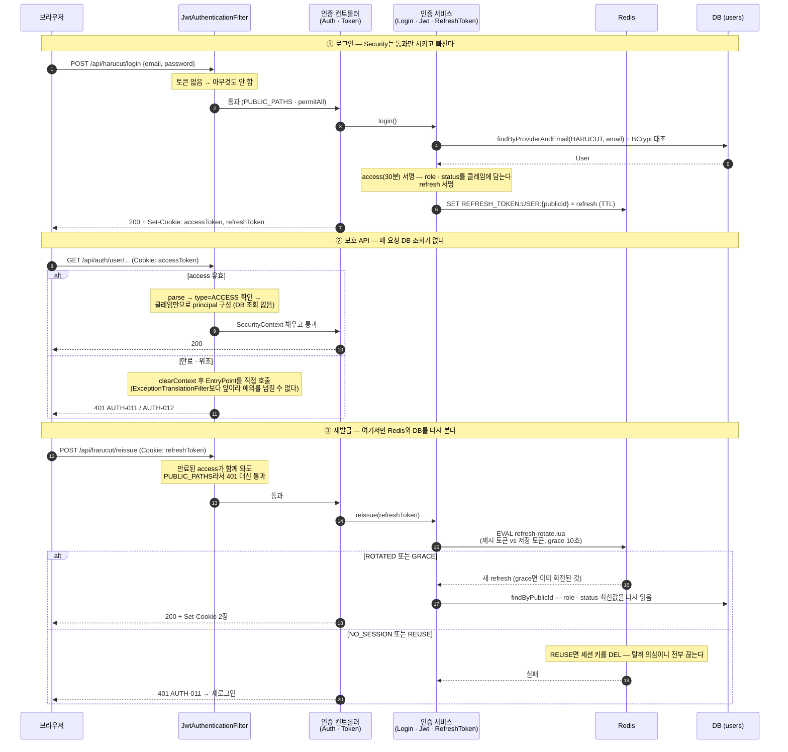
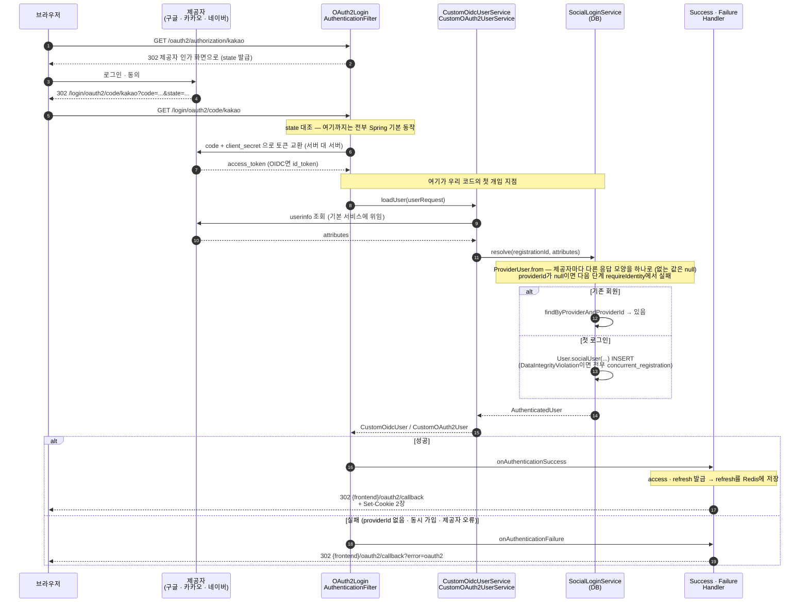
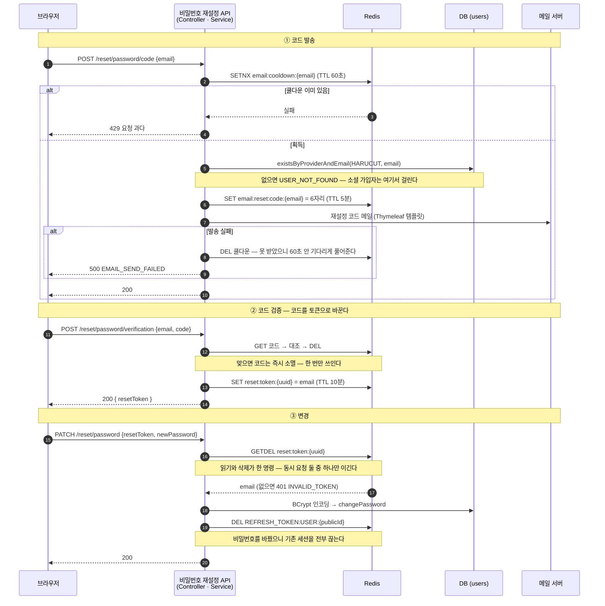
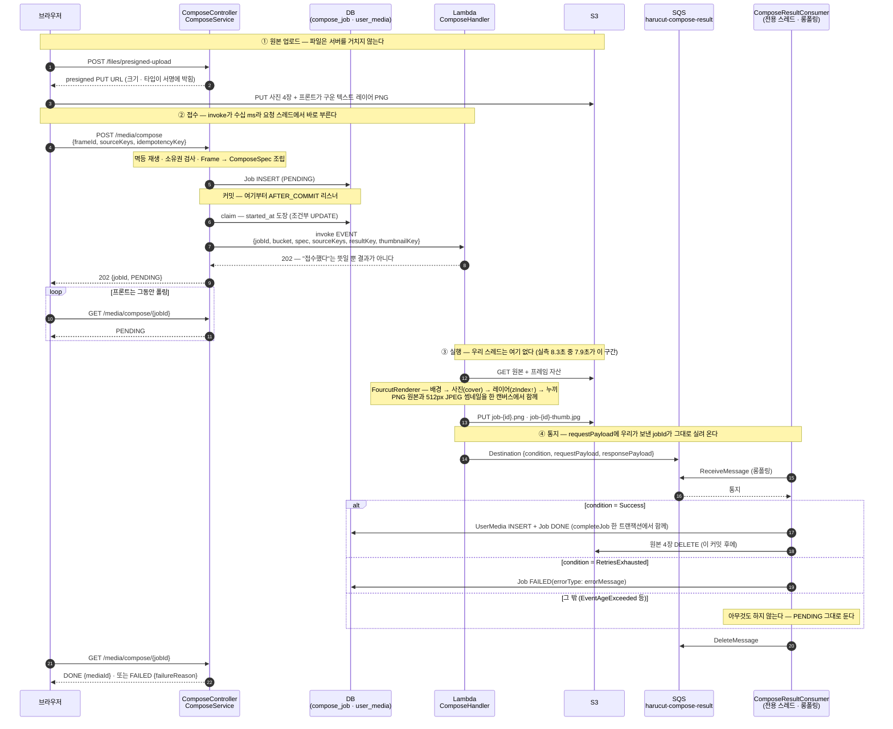
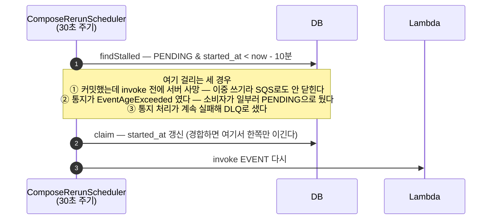
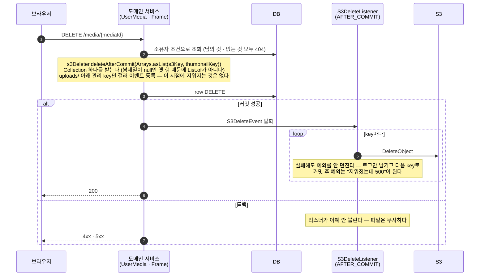
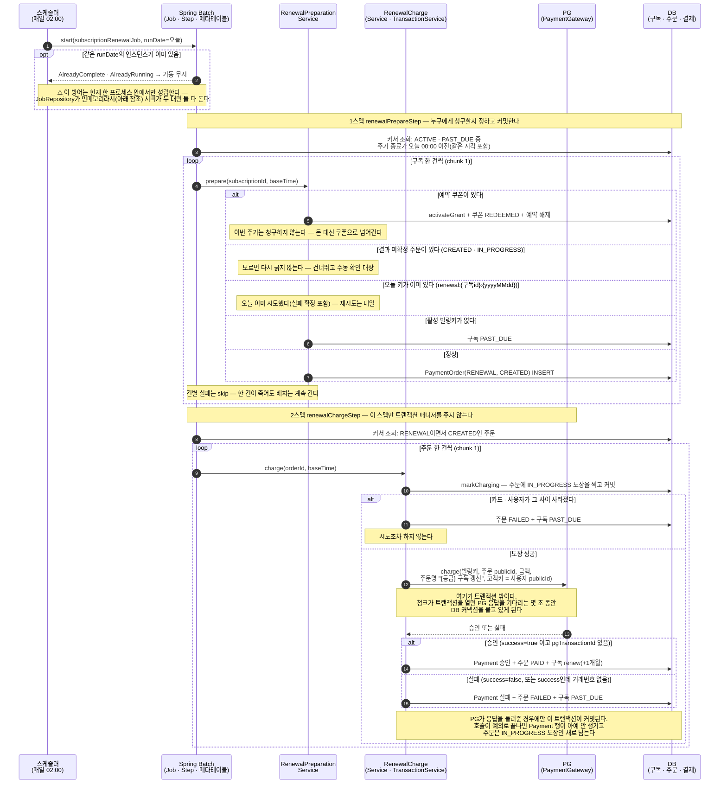
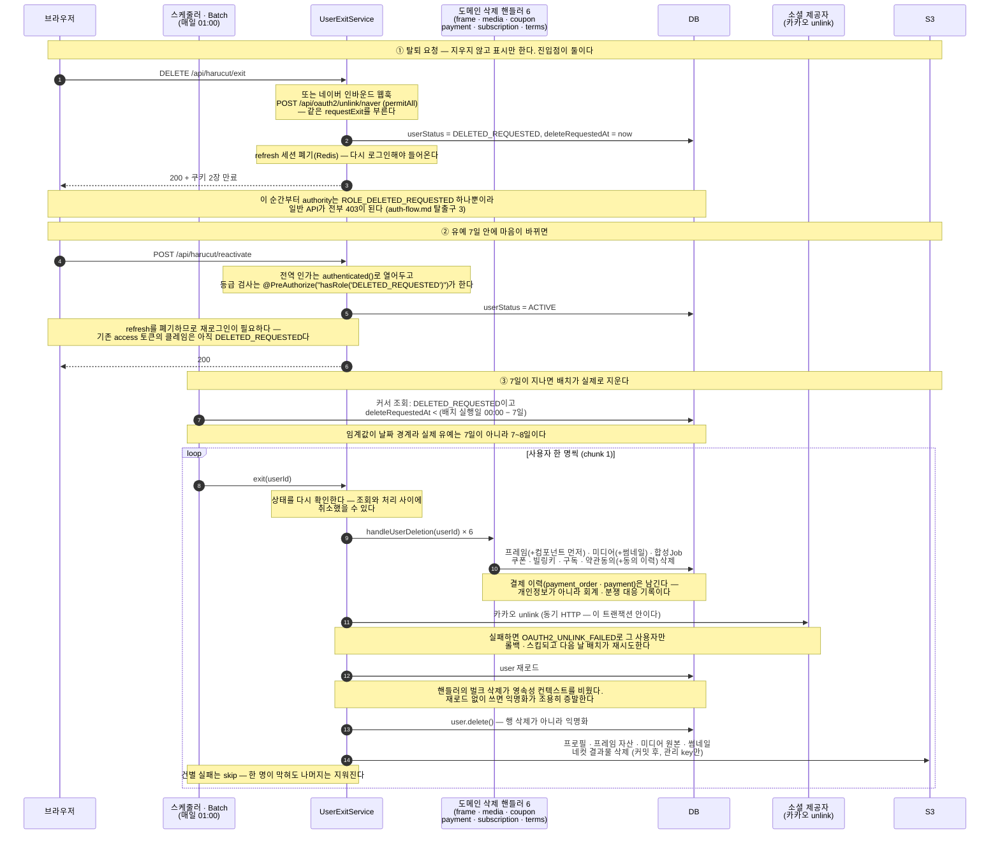

# 시퀀스 다이어그램

이 문서는 **우리가 만든 것**을 기록한다. 옵시디언 볼트의 역추출 명세(`00~12`)가 기존 Kotlin 구현을 기록한 것과 성격이 다르다.
그림은 모두 Java 재구현의 **실제 코드 기준**이며, 코드가 바뀌면 여기도 바뀌어야 한다.

> 코드에 **없는 것**을 이 문서가 있다고 서술한 적이 있다.
> 인용하기 전에 [`decisions.md`의 «아직 코드에 없는 것»](decisions.md#아직-코드에-없는-것-문서가-있다고-말하면-안-되는-것) 표를 먼저 볼 것.

## 세로줄을 고르는 규칙

한 그림에 세로줄은 **넷에서 여섯**. 그 이상은 화살표를 세느라 흐름을 못 읽는다.
남길 것을 고르는 기준은 하나다 — **거기서 갈라지는가.**

| 남긴다 | 뺀다 |
|--------|------|
| 상태를 들고 있는 것 (Redis, DB, S3) | 통과만 시키는 것 (CorsFilter, HeaderWriter…) |
| 스레드·프로세스가 바뀌는 경계 | 같은 스레드 안의 계층 분리 (Controller ↔ Service) |
| 실패의 갈래가 시작되는 지점 | 포장·변환만 하는 것 (CookieManager, DTO 매퍼) |

계층(Controller/Service/Repository)은 세로줄이 아니다. 그건 **패키지 구조**지 흐름이 아니다.
그래서 아래 그림들은 대부분 컨트롤러와 서비스를 한 줄로 합쳤다.

## 목차

| # | 흐름 | 핵심 |
|---|------|------|
| [1](#1-로컬-인증--로그인--보호-api--재발급) | 로컬 인증 | access는 무상태, refresh만 Redis |
| [2](#2-소셜-로그인-oauth2) | 소셜 로그인 | Security가 주도하고 우리는 두 지점에만 낀다 |
| [3](#3-비밀번호-재설정) | 비밀번호 재설정 | 세 요청을 잇는 것은 Redis뿐 |
| [4](#4-네컷-합성-lambda) | 네컷 합성 | 접수와 완료가 다른 줄에서 일어난다 |
| [5](#5-s3-삭제-커밋-후) | S3 삭제 | 롤백이 없는 작업은 커밋 뒤로 민다 |
| [6](#6-구독-갱신-배치) | 구독 갱신 배치 | 커밋 셋 사이에 PG 호출이 떠 있다 |
| [7](#7-회원-탈퇴--요청과-하드삭제-사이-7일) | 회원 탈퇴 | 표시하는 시점과 지우는 시점이 7일 떨어져 있다 |

필터 체인 **내부**에서 401과 403이 각각 어디서 만들어지는지는 [`auth-flow.md`](auth-flow.md)에 따로 있다.
이 문서는 그보다 한 단계 위 — 도메인 흐름을 본다.

---

## 1. 로컬 인증 — 로그인 · 보호 API · 재발급

Redis와 DB를 둘 다 남긴 이유가 이 그림의 전부다. **access는 DB를 안 보고, refresh는 Redis를 본다.**
`JwtTokenService`·`CookieManager`는 서명과 포장만 하므로 서비스 줄에 합쳤다.

**읽어야 할 것 셋**

1. **②에 `D`로 가는 화살표가 없다.** role·status를 access 클레임에 실었기 때문이다.
   대가는 **권한 변경이 최대 30분 늦게 반영된다** — 차단(BLOCKED)이 즉시 안 먹는다.
   단, **없어진 것은 인증 필터 구간의 조회다.** 예로 든 `/api/auth/user/...` 같은 API는
   서비스 계층에서 여전히 `publicId`로 User를 읽는다. 요청 전체가 조회 0이 되는 건
   `/auth/status`·`logout`처럼 서비스가 User를 필요로 하지 않는 경로뿐이다.
   (그리고 지금은 `BLOCKED`로 전환하는 코드 자체가 없어서 이 30분 대가를 치를 일이 아직 없다.)
2. **이 그림 안에서는 ①과 ③만 Redis를 쓴다.** refresh는 서버가 취소할 수 있어야 하니 상태가 필요하고,
   access는 그럴 필요가 없어서 무상태다. 이 비대칭이 설계의 중심이다.
   (그림 밖의 로그아웃·비밀번호 재설정·탈퇴도 refresh 세션 키를 지우므로 Redis를 쓴다.)
3. **③에서 `D`를 다시 읽는 이유가 ②에 화살표가 없는 이유와 짝이다.**
   재발급이 클레임을 갱신할 수 있는 유일한 지점이다.

이 그림은 ②의 실패를 401 하나로 뭉뚱그렸다. 인증은 됐는데 **등급이 모자라서** 나는 403이 어디서
만들어지는지, 그게 관리자 API의 403과 왜 다른 경로인지는 [`auth-flow.md`](auth-flow.md)의 "빠져나가는 지점"에 있다.

> ⚠️ **`auth-flow.md`는 이 결정 이전 상태에 멈춰 있다.** 필터가 `loadUserByPublicId`를 부른다고 서술하지만
> 그런 메서드는 코드에 없고, "`AccessDeniedHandler`를 등록하지 않았다"고 단언하지만 `SecurityConfig`가 등록했다.
> 그래서 그 문서의 "빠져나가는 지점 **세** 곳"은 코드 기준으로는 **네** 곳이다(`anyRequest().hasAnyRole(...)`이
> 만드는 필터 레벨 403 경로가 빠졌다). 읽기 전에 그 문서를 먼저 고칠 것.

---

## 2. 소셜 로그인 (OAuth2)

1번과 정반대 구조다. 로컬 로그인은 Security가 통과만 시키지만, **소셜은 Security가 흐름을 주도하고
우리 코드는 몇 지점에만 낀다** — 사용자 정보를 받는 곳 **둘**(OIDC인 구글·카카오는 `CustomOidcUserService`,
순수 OAuth2인 네이버는 `CustomOAuth2UserService`)과 끝난 뒤 토큰을 발급하는 `CustomOAuth2SuccessHandler`.
실패 경로의 `CustomOAuth2FailureHandler`까지 세면 넷이다.
그래서 세로줄을 "우리 코드"가 아니라 **Security의 확장 지점** 기준으로 골랐다.
Redis는 화살표 하나뿐이라 주석으로 내렸다.

**읽어야 할 것 셋**

1. **`JwtAuthenticationFilter`가 이 그림에 없지만, 안 도는 것은 아니다.** 필터는 소셜 콜백 요청에서도
   그대로 돌고, 유효한 accessToken 쿠키가 남아 있으면 SecurityContext까지 채운다(OAuth2 흐름을 막지는 않는다).
   `/oauth2/**`·`/login/oauth2/**`가 PUBLIC이라는 것이 하는 일은 "필터를 건너뛰게" 하는 게 아니라,
   **토큰이 깨졌을 때 401을 내지 않고 체인을 계속 태우는 것**이다.
   그리고 로컬과 소셜의 차이는 "다른 필터"가 아니다 — **로컬은 컨트롤러**(`AuthController.login` →
   `LoginService`가 `AuthenticationManager`를 직접 호출, formLogin은 꺼져 있다), **소셜만 필터**가 주도한다.
2. **응답이 JSON이 아니라 302 + 쿠키다.** 브라우저가 제공자를 거쳐 돌아오는 구조라
   JSON을 줄 상대가 없다 — 받는 쪽은 프론트의 콜백 페이지다.
   실패도 같은 자리로 보내되 `?error=oauth2`만 붙인다
   (`decisions.md` 2026-08-14 «소셜 로그인 결과를 쿠키 + 302 리다이렉트로 전달한다»).
3. **`S`가 `provider + providerId`로 찾는다. 이메일로 찾지 않는다.**
   같은 이메일이어도 제공자가 다르면 **별개 계정**이라는 결정이 이 화살표 하나에 들어 있다.

---

## 3. 비밀번호 재설정

요청이 셋으로 쪼개져 있어서 "무엇이 세 요청을 잇는가"가 핵심이다. 답은 **Redis뿐**이고,
그래서 Redis를 세로줄로 남겼다. 컨트롤러와 서비스는 한 줄로 합쳤다 — 사이에 갈림길이 없다.

**읽어야 할 것 셋**

1. **DB는 두 번만 나온다** — 존재 확인과 최종 변경. 세 요청을 잇는 신원은 전부 Redis에 있고,
   TTL이 곧 만료 정책이다(코드 5분, 토큰 10분). 서버 재시작에도 흐름이 안 끊긴다.
2. **코드는 `DEL`, 토큰은 `GETDEL`이다.** 토큰만 원자적인 이유는 마지막 단계가
   **비밀번호를 실제로 바꾸기** 때문이다 — 같은 토큰으로 두 번 들어오면 안 된다.
3. **③이 refresh 세션을 지운다.** 이게 없으면 "비밀번호를 바꿨는데 탈취자는 계속 로그인 상태"가 된다.
   비밀번호 변경이 세션 무효화와 한 트랜잭션에 묶여야 하는 이유다.

> **판단할 것 —** ①에서 미가입 이메일에 `USER_NOT_FOUND`를 그대로 돌려준다.
> 즉 **어떤 이메일이 가입돼 있는지 확인할 수 있다.** 쿨다운은 이메일별이라 여러 주소를 동시에 물으면
> 제한이 안 걸린다. 안 알려주고 200을 주면(있든 없든 같은 응답) 열거를 막지만,
> 사용자는 "메일이 왜 안 오지"를 스스로 알아내야 한다. 지금은 UX 쪽을 택한 상태 — 의도한 것인지 확인 필요.

---

## 4. 네컷 합성 (Lambda)

세로줄 기준은 **프로세스와 큐의 경계**다. 요청 스레드(API), 다른 프로세스(Lambda),
그 사이를 잇는 큐(SQS), 큐를 읽는 전용 스레드(Consumer)가 각각 별개 줄이라야
"접수와 완료가 다른 줄에서 일어난다"가 그림에 보인다.
결정 배경은 `decisions.md` 2026-08-17 «네컷 합성을 프론트에서 백엔드로 옮긴다»,
2026-08-21 «합성 Lambda 호출을 비동기로 바꾸고, 결과는 Destinations → SQS로 받는다».

**읽어야 할 것 넷**

1. **`API → L` 화살표가 커밋 이후다.** 커밋 전에 부르면 아직 보이지 않는 Job에
   결과를 쓰려다 깨진다. `@TransactionalEventListener(AFTER_COMMIT)`가 그 순서를 강제한다.
2. **`L → API`의 202는 완료 통지가 아니다.** 예전에는 이 응답 하나가 완료를 뜻해서
   콜백도 큐도 필요 없었는데, 대신 **스레드가 8.3초를 붙잡고 있었다.**
   비동기로 바꾸면서 그 스레드가 풀렸고, 그 값으로 SQS 한 줄이 늘었다.
3. **`claim`이 invoke보다 먼저다.** 순서가 반대면 통지가 먼저 돌아와,
   아직 도장이 안 찍힌 Job을 만난다.
4. **원본 DELETE가 `Job DONE` 뒤에 있다.** 순서가 반대면 실패했을 때
   원본이 사라져 재실행이 불가능하다.

### 통지가 끝내 오지 않았을 때

**10분이라는 숫자는 임의가 아니다.** Lambda 비동기 이벤트 수명(5분) + 함수 타임아웃(60초) + 여유다.
이보다 짧으면 **아직 Lambda 큐에 살아 있는 이벤트를 다시 던지게 된다.**

`EventAgeExceeded`에서 소비자가 아무것도 하지 않는 것이 이 설계의 핵심이다.
거기서 `failJob`을 부르면 **재시도 가능한 실패가 영구 손실이 된다** —
2026-08-21 측정에서 429 `Rate Exceeded`가 정확히 그렇게 죽었다(18건 중 8건).

> **로컬·테스트에도 인프로세스 실행기가 없다.** `InProcessComposeExecutor`는 비동기 전환과 함께
> 지웠다 — `ComposeExecutor.execute()`가 "다 그렸다"(인프로세스)와 "접수했다"(Lambda)라는
> 두 계약을 갖게 되기 때문이다. 그래서 **합성은 로컬에서도 실제 AWS를 거친다.**
> 픽셀 검증은 `compose-core`의 `FourcutRendererTest`, 다운로드·렌더·업로드 글루는
> `compose-lambda`의 `ComposeHandlerTest`가 덮는다.

---

## 5. S3 삭제 (커밋 후)

가장 짧지만 **"왜 커밋 후인가"는 시퀀스로 보여줄 때 제일 빠르다.**
`S3Deleter`는 발행만 하고 아무것도 지우지 않으므로 주석으로 내렸다.
아래는 미디어 삭제 기준이지만, 프레임 삭제·프레임 자산 교체도 **같은 장치**를 쓴다.

**읽어야 할 것 셋**

1. **순서를 뒤집을 수 없다.** S3 삭제에는 롤백이 없다. DB 커밋이 진실이 확정되는 유일한 지점이라
   그 뒤로 민다. 반대로 했다면 롤백된 요청이 파일만 지우고 가는 사고가 난다.
2. **실패를 삼키는 방향이 한쪽으로 정해져 있다.** 고아 파일(스토리지 비용) vs 사용자에게 보이는 500 —
   전자를 택했다. 그래서 `catch`가 key 단위로 들어가 있다(하나 실패해도 나머지는 지운다).
3. **발행이 트랜잭션 밖이면 리스너가 조용히 안 불린다** (`fallbackExecution` 기본 false).
   에러도 로그도 없이 파일만 안 지워진다. 즉 `deleteAfterCommit`을 부르는 메서드는 반드시 `@Transactional` 안이어야 한다.
   ⚠️ **그런데 이 조용한 실패를 잡는 테스트는 지금 없다.** `S3DeleteFlowTest`가 고정하는 것은
   "커밋 후에만 지워지고 롤백이면 안 지워진다"는 **의미론**이고, 그 테스트는 `TransactionTemplate`으로
   경계를 스스로 만들기 때문에 **서비스 메서드에서 `@Transactional`이 빠져도 그대로 통과한다.**
   실질적인 방어선은 `S3Deleter`·`S3DeleteListener`의 주석뿐이다.

프레임 자산 **교체** 때도 같은 장치가 쓰인다. 다른 점은 넘기는 key가 "삭제 대상 전부"가 아니라
**"교체로 참조를 잃은 key만"**이라는 것 — 아직 쓰이는 key를 지우면 멀쩡한 프레임이 깨진다.

걸러내기(null·비관리 key·중복)와 이벤트 발행은 storage의 공용 부품 `S3Deleter`가 한다.
`FrameAssetManager.deleteAfterCommit`은 프레임 쪽 얇은 위임이고, media는 `S3Deleter`를 직접 쓴다.
**예외가 하나 있다** — `UserExitService`만 `S3Deleter`를 우회해 `ApplicationEventPublisher`로
`S3DeleteEvent`를 직접 발행한다. 즉 진입점이 완전히 하나로 모이지는 않았다.

---

## 6. 구독 갱신 배치

세로줄을 고른 기준은 **커밋 경계**다. 이 흐름의 어려움은 전부 "어디서 커밋하고 어디서 PG를 부르는가"에 있고,
그게 세 파일에 흩어져 있어 코드로는 안 보인다. `Spring Batch`를 한 줄로 남긴 이유는
중복 기동 거절·커서 조회·건별 skip이 전부 거기서 나기 때문이다.

**읽어야 할 것 셋**

1. **PG 화살표가 어느 커밋 사이에 떠 있다.** 이 흐름의 커밋은 셋이다 —
   준비 커밋 → 도장 커밋 → 결과 커밋. PG 호출은 2번과 3번 **사이**, 즉 트랜잭션 밖에 있다.
   그러려고 `renewalChargeStep`에는 트랜잭션 매니저를 **일부러 주지 않았다.**
   코드에 "없는 것"이라 주석이 없으면 안 보이는 결정이라, 그 자리에 세 줄 주석으로 남겨뒀다
   (`SubscriptionRenewalJobConfig`의 `renewalChargeStep` 바로 위).
2. **`IN_PROGRESS` 도장의 쓸모가 둘이다.** 하나는 프로세스가 PG 호출 중에 죽었을 때
   "긁었는지 모르는 건"을 식별하는 표식이고, 둘은 2스텝 reader가 `CREATED`만 읽으므로
   **자동으로 재시도 대상에서 빠지는** 것이다. 다음 날 1스텝이 그 주문을 보고 새 청구를 막는다.
3. **한 건의 실패가 배치를 멈추지 않는다.** 두 스텝 모두 `AlwaysSkipItemSkipPolicy`다.
   다만 **두 스텝의 실패 모양이 다르다.** 1스텝은 skip되며 경고 로그가 남는다.
   2스텝은 청크 롤백 뒤 재스캔으로 처리되는데, 재시도에서 `markCharging`이 `IN_PROGRESS` 도장을 보고
   아무것도 하지 않아 **"성공"으로 끝난다** — skip 카운트도 0이고 skip 로그도 안 남는다.
   흔적은 롤백 1회와 `IN_PROGRESS`로 남은 주문뿐이다.
   **같은 주문이 PG로 두 번 나가지 않는 보장이 바로 여기서 나온다.**

> **⚠️ JobRepository가 인메모리다.** `@EnableJdbcJobRepository`도 커스텀 `JobRepository` 빈도 없어서,
> Boot 4.1이 꽂아주는 것은 Spring Batch 6의 기본값인 `ResourcelessJobRepository`다
> (`DefaultBatchConfiguration.jobRepository()`가 `new ResourcelessJobRepository()`를 돌려준다).
> 메타테이블을 아예 안 쓰고, `jobInstance`·`jobExecution`을 **필드 하나씩**으로만 들고 있다 — 맵도 아니다.
> 결과가 셋이다. ① 재시작하면 실행 이력이 사라진다. ② **서버가 두 대면 각자 자기 메모리를 보므로 둘 다 돈다**
> — "메타테이블 unique가 분산 락 역할을 한다"는 말은 지금 코드에서 성립하지 않는다.
> ③ 잡 셋이 그 한 칸을 공유해서, 나중에 뜬 잡이 앞선 잡의 인스턴스 기록을 덮는다.
> **중복 기동을 실제로 막는 것은 지금 "서버가 한 대"라는 사실뿐이다.**
> 고치려면 `@EnableJdbcJobRepository` + 배치 메타테이블 DDL이 필요하다(현재 `resources/`에 스키마가 없다).

> **여기서 결정되지 않은 것 —** `IN_PROGRESS`로 남은 주문을 누가 치우는가.
> 지금은 아무도 안 치운다. 다음 날 1스텝이 "미확정 주문 있음"으로 **건너뛰기만** 하므로,
> 사람이 PG 콘솔을 보고 손으로 정리하기 전까지 그 사용자는 갱신이 영구히 멈춘다.
> 웹훅이 붙으면 이 자리가 자동으로 메워진다 — 그래서 웹훅 설계가 이 그림과 한 묶음이다.

---

## 7. 회원 탈퇴 — 요청과 하드삭제 사이 7일

시점이 둘로 갈리는 흐름이라 시퀀스가 잘 맞는다. 사용자가 누르는 순간(soft)과
7일 뒤 배치가 실제로 지우는 순간(hard)이 한 그림에 들어가고, 그 사이에 취소 분기가 있다.
도메인 핸들러 여섯은 한 줄로 합쳤다 — 서로 다른 일을 하지만 **호출 규약이 같다.**

**읽어야 할 것 셋**

1. **①에서 아무것도 지우지 않는다.** 지우는 것은 ③뿐이고 그 사이 유예는 되돌릴 수 있다.
   "탈퇴 API가 데이터를 지운다"고 생각하면 ②가 왜 가능한지 설명이 안 된다.
   유예는 정확히 7일이 아니라 **7~8일**이다 — 커서 조건이 "요청 시각 + 7일"이 아니라
   "`deleteRequestedAt` < (배치 실행일 00:00 − 7일)"이라, 요청 시각의 시·분이 늦을수록 길어진다.
   실행일이 2030-01-10이면 임계값은 2030-01-03 00:00이고, 01-02 23:00 요청은 약 7.0일 뒤,
   01-03 01:00 요청은 다음 날 배치로 밀려 약 8.0일 뒤에 지워진다.
2. **user 행은 끝까지 살아남는다.** `delete()`는 삭제가 아니라 익명화다.
   결제 이력의 `user_id`가 계속 유효해야 하기 때문이다 — 사람은 지우고 장부는 남긴다.
3. **핸들러 여섯이 한 트랜잭션 안에서 돈다.** 각 핸들러의 `@Transactional`은 기본 전파라
   배치 청크가 연 트랜잭션에 **합류**한다. 즉 한 사용자의 삭제는 전부 되거나 전부 안 된다.
   S3 삭제 이벤트들이 그 커밋 뒤에 한꺼번에 나가는 것도 같은 이유다 (5번 참조).

> **`exit()`의 `@Transactional`은 지금은 새 경계를 만들지 않는다.** 유일한 호출부가 배치 writer이고
> writer는 이미 청크 트랜잭션 안에서 돌기 때문에, 이 애너테이션을 떼도 핸들러들은 그 청크 트랜잭션에
> 합류하고 `AFTER_COMMIT` 리스너도 정상 발화한다. 즉 지금은 **합류할 뿐**이다.
> 이 애너테이션이 실제로 의미를 갖는 시점은 배치 밖(온라인 API·테스트 등)에서 `exit()`를
> 직접 부르게 될 때다. 그때 떼면 핸들러별로 트랜잭션이 쪼개져 부분 커밋이 나고,
> S3 이벤트는 리스너가 아예 안 불린다.
>
> **그리고 이 트랜잭션 안에 외부 HTTP 호출이 하나 들어 있다** — 카카오 unlink다.
> 6번(갱신 배치)에서 "PG 호출을 트랜잭션 밖으로" 원칙을 세워놓고 여기서는 반대로 하고 있다.
> 갱신 배치에서 배운 것을 탈퇴 배치에 아직 적용하지 않은 상태다.

---

## 아직 안 그린 것

| 흐름 | 왜 아직인가 |
|------|-------------|
| PG 웹훅 | 서명 검증은 `PaymentWebhookController`가 `PaymentWebhookVerifier`로 이미 하고, `WebhookService`는 본문 길이만 로그로 찍는 스텁이다. **코드보다 먼저 그려야 할 것** — "웹훅이 먼저냐 승인 응답이 먼저냐", "두 번 오면", "안 오면" 세 갈래를 그림에서 정하지 않으면 코드가 정해버린다. 6번의 `IN_PROGRESS` 고아 문제가 여기서 메워진다 |
| 첫 구독 결제 | 6번과 같은 문제의 온라인 버전(`REQUIRES_NEW` 둘 + 멱등키 재생). 6번과 나란히 놓으면 "왜 배치는 도장을 찍고 온라인은 안 찍나"가 보인다 — 다음 후보 |
| 쿠폰 등록 | 등록만 그리면 이야기가 끊긴다. 예약 쿠폰의 결말은 6번 1스텝 첫 분기에 있다 |
| 구독 프로비저닝 | `UserRegisterEvent` → 리스너. 화살표 두 개라 문장 한 줄이 낫다 |
| 약관 · 공지 CRUD | 분기가 없다. 시퀀스로 얻을 게 없다 |

## 시퀀스가 맞지 않는 것

아래 둘은 **상태 기계**(`stateDiagram-v2`)로 그려야 보인다. 시퀀스로 그리면 전이가 여러 그림에 흩어진다.

| 대상 | 왜 |
|------|-----|
| `OrderStatus` | `CREATED → IN_PROGRESS → PAID·FAILED`. 전이가 온라인 결제와 갱신 배치 두 경로에 나뉘어 있어, 어느 상태가 어느 경로에서만 나오는지 코드로는 안 잡힌다 |
| `SubscriptionStatus` | 전이 메서드가 여섯, 호출부가 넷(결제 · 배치 · 쿠폰 · 구독 API). 그려보면 `expireToFree()`를 부르는 곳이 **만료 배치 하나뿐**이라는 것이 바로 보인다 — 강등 시점이 배치 주기(매일 02:30)에 묶여 있고, 그 공백기를 읽기 시점 `effectiveTier`가 메우고 있다 |
